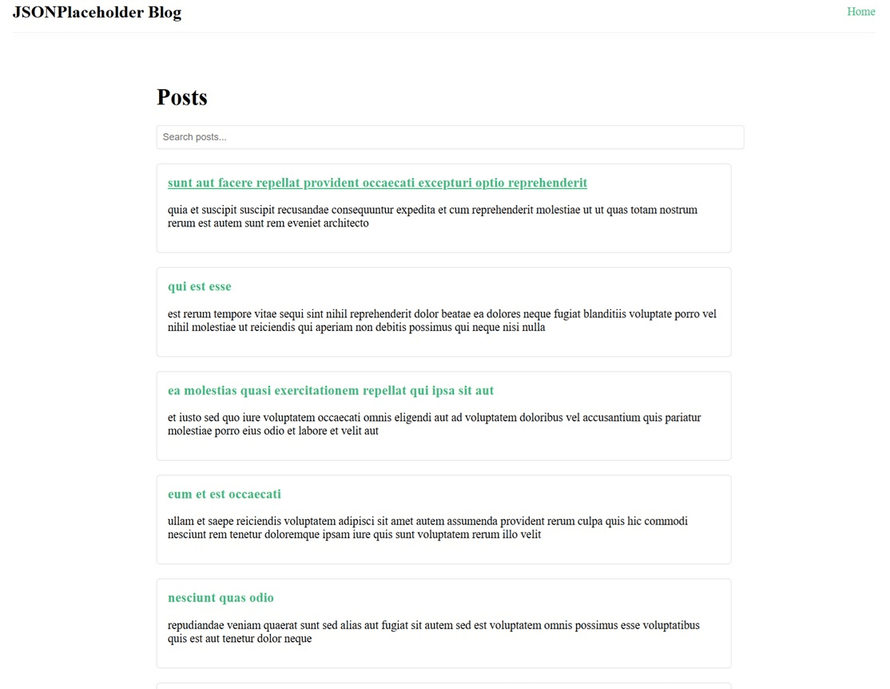
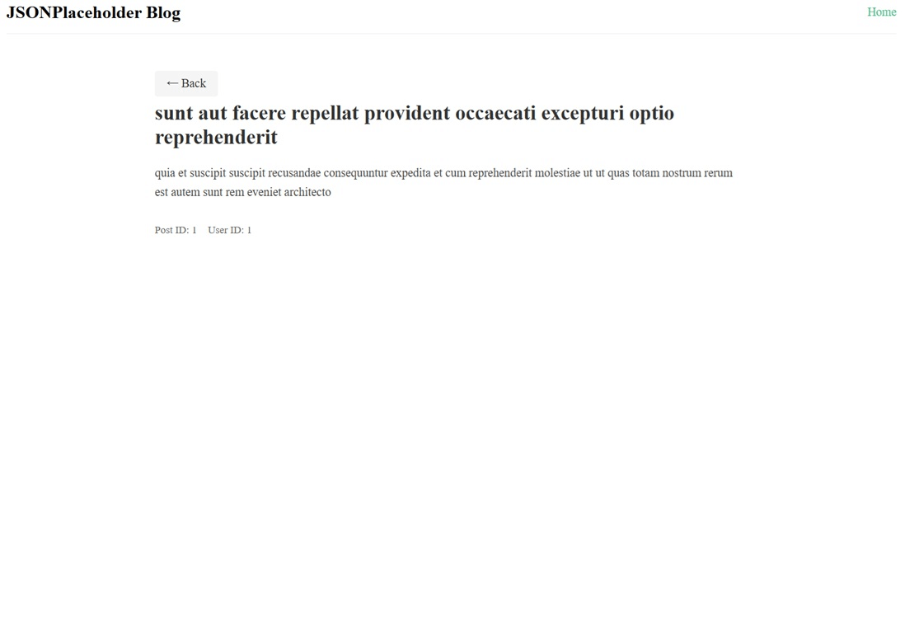
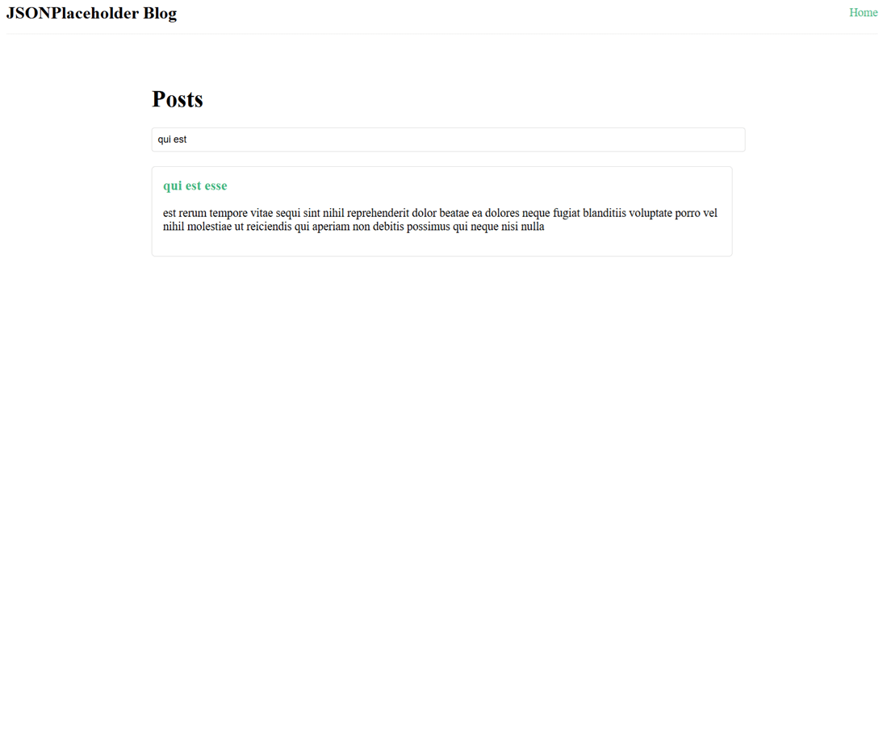

# JSONPlaceholder Blog на Vue 3

[](https://it-joy.github.io/vue-jsonplaceholder-blog/)

Приложение для просмотра постов с JSONPlaceholder API с пагинацией и поиском


## 📸 Скриншоты интерфейса

### Главная страница


### Страница поста


### Поиск


## 📌 Особенности
- Просмотр постов с пагинацией (по 10 на странице)
- Страница детализации поста
- Поиск по заголовку и содержимому
- Чистая архитектура FSD
- TypeScript без `any`
- Адаптивный дизайн

## 🛠 Технологии
- Vue 3 (Composition API)
- TypeScript
- Vite
- Vue Router
- Axios
- GitHub Pages (для демо)

## 🚀 Запуск проекта

### Установка зависимостей
```bash
npm install
```
### Разработка
```bash
npm run dev
```
### Сборка для production
```bash
npm run build
```
### Проверка типов TypeScript
```bash
npm run type-check
```

## 📂 Структура проекта (FSD)

```bash

src/
├── app/                    # Инициализация приложения
│   ├── App.vue             # Корневой компонент
│   ├── main.ts             # Точка входа
│   └── router/             # Конфигурация роутера
│       └── index.ts        
├── pages/                  # Страницы
│   ├── HomePage/           # Домашняя страница с постами
│   │   ├── index.vue       
│   │   └── model/          # Логика страницы
│   │       ├── api.ts      
│   │       ├── types.ts    
│   │       └── usePosts.ts 
│   └── PostPage/           # Страница поста
│       ├── index.vue       
│       └── model/          
│           ├── api.ts      
│           ├── types.ts    
│           └── usePost.ts  
├── widgets/                # Виджеты (переиспользуемые компоненты)
│   ├── Pagination/         
│   │   ├── index.vue       
│   │   └── model/          
│   │       └── types.ts    
│   └── Search/             
│       ├── index.vue       
│       └── model/          
│           └── types.ts    
└── shared/                 # Общие компоненты и утилиты
    ├── api/                
    │   └── client.ts       # HTTP клиент
    ├── ui/                 
    │   ├── PostCard/       # Карточка поста
    │   │   ├── index.vue   
    │   │   └── model/      
    │   │       └── types.ts
    │   ├── BackButton/     # Кнопка «Назад»
    │   │   └── index.vue    
    │   └── Loader/         # Индикатор загрузки
    │       └── index.vue   
    └── utils/              
        └── constants.ts    # Константы
```

## 🔗 Полезные ссылки

- [Демо на GitHub Pages](https://it-joy.github.io/vue-jsonplaceholder-blog/)
- [JSONPlaceholder API](https://jsonplaceholder.typicode.com/)
- [Документация Vue 3](https://vuejs.org/)